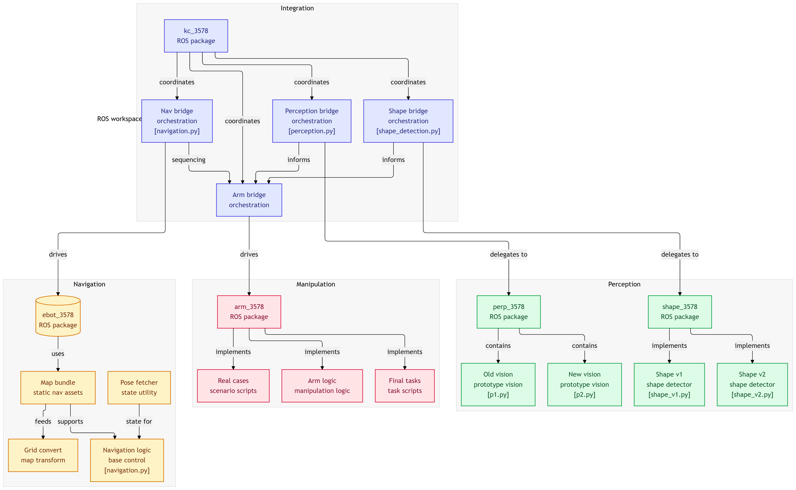

# ros_ws — e-Yantra IIT Bombay 2026 Finalist Team

# TEAM MEMBERS:
1. [Aman Ratanlal Chauhan](https://github.com/amanchauhan-dev)
2. [Harshil Rahulbhai Mehta](https://github.com/mehta-harshil)
3. [Raghav Jibachha Mandal](https://github.com/raghavmandal0511-netizen)
4. [Ashishkumar Rajeshkumar Jha](https://github.com/Ashish-jha-85)

**ros_ws** is the primary ROS workspace developed for the **e-Yantra IIT Bombay Competition 2026**, integrating navigation, perception, and manipulation into a coordinated robotic system. The architecture is modular, with bridge-based orchestration layers that connect high-level task logic to domain-specific ROS packages.

This workspace implements a structured pipeline where perception modules detect objects and shapes, navigation handles robot mobility, and manipulation controls robotic arm execution. A central coordination layer manages communication between subsystems to enable reliable autonomous operation.

---

# System Architecture Overview

The workspace is divided into four major domains:

* **Integration Layer**
* **Navigation**
* **Manipulation**
* **Perception**

Each domain is implemented as a separate ROS package or set of packages, coordinated through bridge-based orchestration nodes.

---

# Integration Layer

The **integration layer** coordinates the full robot workflow and acts as the central control unit.

## kc_3578 — Core Integration Package

This package contains orchestration bridges responsible for synchronizing different robot subsystems.

### Navigation Bridge (`navigation.py`)

* Coordinates robot movement commands.
* Sequences navigation actions.
* Interfaces with navigation ROS package.
* Supplies pose and coordinate targets.

### Perception Bridge (`perception.py`)

* Receives perception outputs.
* Passes environmental updates to the system.
* Provides object/location information.

### Shape Bridge (`shape_detection.py`)

* Handles shape recognition workflow.
* Receives detected shape data.
* Routes processed shape information.

### Arm Bridge

* Central manipulation coordinator.
* Executes arm-related task sequences.
* Interfaces with the arm control package.

---

# Navigation Domain

## ebot_3578 — Navigation Package

Handles robot localization, mapping, and movement.

### Components

**Map Bundle**

* Static navigation assets.
* Predefined map resources.

**Pose Fetcher**

* Retrieves robot pose state.
* Supplies navigation state updates.

**Grid Convert**

* Performs map transformations.
* Converts grid representations.

**Navigation Logic (`navigation.py`)**

* Implements base movement control.
* Handles navigation state transitions.

---

# Manipulation Domain

## arm_3578 — Manipulation Package

Controls robotic arm operations and task execution.

### Components

**Real Case Scripts**

* Implements real-world task scenarios.
* Executes predefined workflow sequences.

**Arm Logic**

* Core manipulation control logic.
* Handles joint-level actions.

**Final Task Scripts**

* Executes final-stage mission workflows.
* Integrates perception outputs into manipulation.

---

# Perception Domain

The perception system is split into two specialized packages.

---

## perp_3578 — Vision Prototype Package

Contains development-stage vision pipelines.

### Components

**p1.py**

* Legacy vision prototype.

**p2.py**

* Updated vision prototype.
* Improved detection pipeline.

---

## shape_3578 — Shape Detection Package

Handles object and shape classification.

### Components

**shape_v1.py**

* Initial shape detection implementation.

**shape_v2.py**

* Updated and refined shape detection system.

---

# Design Philosophy

This workspace follows:

* **Modular package separation**
* **Bridge-based orchestration**
* **Domain-level isolation**
* **Reusable ROS components**
* **Scalable integration architecture**

Each subsystem operates independently but communicates through defined orchestration bridges, improving maintainability and debugging reliability.

---

# Key Features

* Multi-domain robotic integration
* Modular ROS package architecture
* Coordinated navigation, perception, and manipulation
* Shape-based perception pipeline
* Scenario-driven arm task execution
* Designed for competition-grade reliability

---

# Use Case

This workspace was developed for:

**e-Yantra IIT Bombay Robotics Competition 2026 — Finalist Team**

Primary objectives included:

* Autonomous navigation
* Vision-based detection
* Shape recognition
* Robotic manipulation
* Task-level orchestration

---

# Repository Structure (Conceptual)

```
ros_ws/
│
├── kc_3578/        # Integration & orchestration bridges
│
├── ebot_3578/      # Navigation stack
│
├── arm_3578/       # Manipulation control
│
├── perp_3578/      # Vision prototypes
│
├── shape_3578/     # Shape detection modules
│
└── maps/           # Static navigation assets
```
